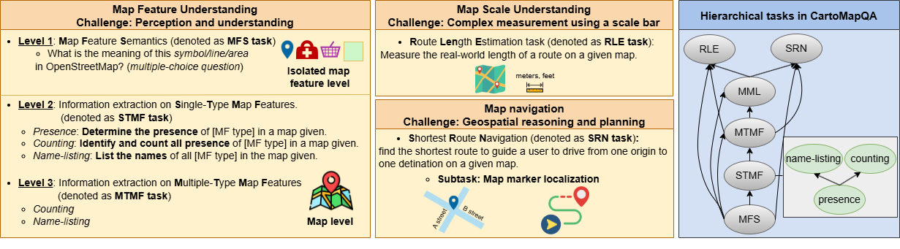

## 💡 Introduction

[**CartoMapQA: A Fundamental Benchmark Dataset Evaluating
Vision-Language Models on Cartographic Map Understanding**](<>)

This repo contains evaluation code for the paper "_CartoMapQA: A Fundamental Benchmark Dataset Evaluating Vision-Language Models on Cartographic Map Understanding_"

_**CartoMapQA**_ offers a valuable tool for guiding future improvements in Vision-Language Models. 
Ultimately, it supports the development of models better equipped for real-world applications that depend on robust and reliable map understanding, such as navigation, geographic search, and urban planning.

We are working hard to make the source code and benchmark dataset publicly available in this repos ASAP. 

- <ins>_**Paper ArXiv**_</ins>: Coming soon ...

- <ins>_**Dataset download link**_</ins>: Coming soon ...

## 📢 News
- **August-5-25**- We're thrilled to share that _**CartoMapQA**_ has been accepted to _**SIGSPATIAL 2025**_ (A rank conf., acceptance rate 26.0%) 🎊

## 📜 Citation
Coming soon ...
