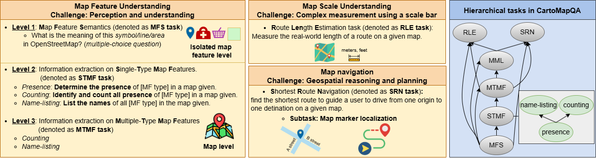

# CartoMapQA: A Fundamental Benchmark Dataset Evaluating Vision-Language Models on Cartographic Map Understanding (SIGSPATIAL'25)

## 💡 Introduction



This repo contains evaluation code for the paper "_CartoMapQA: A Fundamental Benchmark Dataset Evaluating Vision-Language Models on Cartographic Map Understanding_"

_**CartoMapQA**_ offers a valuable tool for guiding future improvements in Vision-Language Models. 
Ultimately, it supports the development of models better equipped for real-world applications that depend on robust and reliable map understanding, such as navigation, geographic search, and urban planning.

- <ins>_**Paper ArXiv**_</ins>: Coming soon ...

## CartoMapQA Dataset
- The full dataset can be download at this [link](https://github.com/ungquanghuy-kddi/CartoMapQA-Dataset).
- The downloaded "zip" file should be unziped in the folder "Dataset" for further evaluation using this source code.

## 📢 News
- **August-05-25**- We're thrilled to share that _**CartoMapQA**_ has been accepted to _**SIGSPATIAL 2025**_ (Best Paper Candidate) 🎊

## Baselines
We evaluated 15 Large Vision-Lanuage Models (LVLMs) on understanding cartographic maps using our CartoMapQA:
- Open-source LVLMs:
1. [Llama-3.2-11B](https://huggingface.co/meta-llama/Llama-3.2-11B-Vision-Instruct)
2. [Llama-3.2-90B](https://huggingface.co/meta-llama/Llama-3.2-90B-Vision-Instruct)
3. [Llama-4-Scout](https://huggingface.co/meta-llama/Llama-4-Scout-17B-16E-Instruct)
4. [LlaVA-OV-7B](https://huggingface.co/llava-hf/llava-onevision-qwen2-7b-ov-hf)
5. [LlaVA-OV-72B](https://huggingface.co/llava-hf/llava-onevision-qwen2-72b-ov-hf)
6. [InternVL-2.5-8B](https://huggingface.co/OpenGVLab/InternVL2_5-8B)
7. [InternVL-2.5-78B](https://huggingface.co/OpenGVLab/InternVL2_5-78B)
8. [Qwen-VL-2.5-7B](https://huggingface.co/Qwen/Qwen2.5-VL-7B-Instruct)
9. [Qwen-VL-2.5-72B](https://huggingface.co/Qwen/Qwen2.5-VL-72B-Instruct)

- Proprietary LVLMs:
10. GPT-4V (*gpt-4-turbo-2024-04-09*)
11. GPT-4o (*gpt-4o-2024-08-06*)
12. OpenAI o1 (*o1-2024-12-17*)
13. OpenAI o3 (*o3-2025-04-16*)
14. Gemini 2.5 Pro (*gemini-2.5-pro-preview-03-25*)
10. Claude 3.7 Sonnet (*claude-3-7-sonnet-20250219*)
  
## Environment setting and dependencies
- For open-source models, please refer to the website of each model to download and setup environments.
- Dependent packages of models from OpenAI: openai=1.59.7
- Dependent packages of Gemini 2.5 Pro: google-generativeai=0.8.3
- Dependent packages of Claude 3.7 Sonnet: anthropic=0.50.0
- For using proprietary LVLMs models, please add your API KEYs to file in folder "*./API_keys/keys.py*" before running these models.

Other necessary packages:
- pillow=11.1.0 
- scikit-learn=1.6.1

## Get responses from LVLMs 
Please refer to scripts "get_response_all_tasks.py" to obtain responses from an LVLM for all tasks.
For example:

```
python get_response_all_tasks.py --model_name gemini-2.5-pro-preview-03-25
```
## Evaluation
Please refer to scripts "evaluate_all_tasks.py" to obtain evaluation results for an LVLM.
For example:

```
python evaluate_all_tasks.py --model_name gemini-2.5-pro-preview-03-25
```

## 📜 Citation
Coming soon ...
